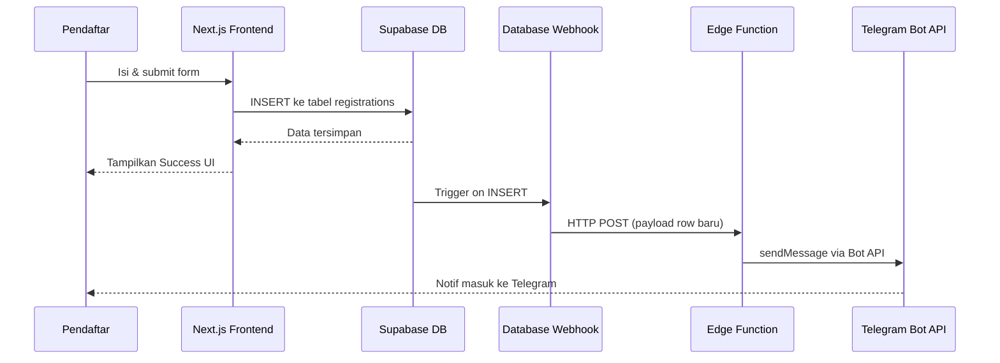

# Notifikasi Telegram Otomatis — Form Pendaftaran NUSA

Setiap kali ada calon santri yang berhasil mengirim form pendaftaran, sistem akan **otomatis mengirim pesan ke bot Telegram** berisi ringkasan data pendaftar baru.

## Gambaran Arsitektur



> [!NOTE]
> Pendekatan ini **100% server-side** dan aman. Token Bot Telegram **tidak pernah** terekspos ke browser. Semua logika berjalan di Supabase Edge Function (Deno runtime). Jangan commit token ke git.

---

## Konfigurasi Bot

| Properti | Nilai |
|---|---|
| **Bot Token** | Lihat Supabase Secret: `TELEGRAM_BOT_TOKEN` |
| **Chat ID** | Lihat Supabase Secret: `TELEGRAM_CHAT_ID` |

> [!CAUTION]
> **Jangan pernah menuliskan Bot Token atau Chat ID secara langsung di kode atau file yang di-commit ke git.** Simpan hanya di Supabase Secrets (lihat langkah 2 di bawah).

---

## Proposed Changes

### 1. Supabase Edge Function

#### [NEW] `supabase/functions/notify-telegram/index.ts`

Buat file ini di project dengan isi berikut:

import "jsr:@supabase/functions-js/edge-runtime.d.ts";

const TELEGRAM_BOT_TOKEN = Deno.env.get("TELEGRAM_BOT_TOKEN")!;
const TELEGRAM_CHAT_ID = Deno.env.get("TELEGRAM_CHAT_ID")!;
const WEBHOOK_SECRET = Deno.env.get("SUPABASE_WEBHOOK_SECRET")!;

Deno.serve(async (req: Request) => {
  // Verifikasi bahwa request berasal dari Supabase Webhook
  const authHeader = req.headers.get("Authorization");
  if (authHeader !== `Bearer ${WEBHOOK_SECRET}`) {
    return new Response("Unauthorized", { status: 401 });
  }

  const payload = await req.json();
  const row = payload.record;

  const programLabel =
    row.pilihan_program === "programmer" ? "💻 Programmer" : "🎨 Designer";

  const waktu = new Date(row.created_at).toLocaleString("id-ID", {
    timeZone: "Asia/Jakarta",
    day: "2-digit",
    month: "long",
    year: "numeric",
    hour: "2-digit",
    minute: "2-digit",
  });

  const esc = (s: unknown): string => String(s ?? '').replace(/&/g, '&amp;').replace(/</g, '&lt;').replace(/>/g, '&gt;');
  const statusDisplay = row.status === "pending" ? "menunggu dihubungi admin" : esc(row.status);
  const linkTes = row.kode_tes 
    ? `https://nusabs.sch.id/test?ref=${row.kode_tes}` 
    : `https://nusabs.sch.id/test?ref=${row.id}`;

  const message = [
    `<b>🎉 Pendaftar Baru NUSA Boarding School 2026/2027!</b>`,
    ``,
    `<b>👤 Nama:</b> ${esc(row.nama_lengkap)}`,
    `<b>📱 WhatsApp:</b> <a href="https://wa.me/${esc(row.nomor_whatsapp)}">+${esc(row.nomor_whatsapp)}</a>`,
    `<b>📅 Tgl Lahir:</b> ${esc(row.tempat_lahir)}, ${esc(row.tanggal_lahir)}`,
    `<b>🏠 Kota:</b> ${esc(row.asal_kota)}`,
    `<b>📍 Alamat:</b> ${esc(row.alamat_lengkap)}`,
    `<b>🏫 Sekolah:</b> ${esc(row.sekolah_asal)} — ${esc(row.lokasi_sekolah)}`,
    `<b>🎓 Program:</b> ${programLabel}`,
    `<b>📢 Sumber Info:</b> ${esc(row.sumber_informasi)}`,
    `<b>📝 Status:</b> ${statusDisplay}`,
    `<b>🔗 Link Tes:</b> ${linkTes}`,
    `<b>🕐 Waktu Daftar:</b> ${waktu} WIB`,
  ].join("\n");

  const telegramRes = await fetch(
    `https://api.telegram.org/bot${TELEGRAM_BOT_TOKEN}/sendMessage`,
    {
      method: "POST",
      headers: { "Content-Type": "application/json" },
      body: JSON.stringify({
        chat_id: TELEGRAM_CHAT_ID,
        text: message,
        parse_mode: "HTML",
        disable_web_page_preview: true
      }),
    }
  );

  if (!telegramRes.ok) {
    const err = await telegramRes.text();
    console.error("Telegram API error:", err);
    return new Response("Failed to send Telegram message", { status: 500 });
  }

  return new Response(JSON.stringify({ success: true }), {
    headers: { "Content-Type": "application/json" },
  });
});
```

---

### 2. Supabase Secrets

Masuk ke **Supabase Dashboard → Project Settings → Edge Functions → Secrets**, tambahkan tiga secret berikut:

| Secret Name | Value |
|---|---|
| `TELEGRAM_BOT_TOKEN` | *(token bot dari BotFather)* |
| `TELEGRAM_CHAT_ID` | *(chat ID grup/pribadi)* |
| `SUPABASE_WEBHOOK_SECRET` | *(buat password acak, misal: `nusa-webhook-2026`)* |

---

### 3. Supabase Database Webhook

Di **Supabase Dashboard → Database → Webhooks → Create a new hook**:

| Pengaturan | Nilai |
|---|---|
| Name | `notify-telegram-on-register` |
| Table | `public.registrations` |
| Events | ☑️ **INSERT** saja |
| Type | **Supabase Edge Functions** |
| Edge Function | `notify-telegram` |
| HTTP Header | `Authorization: Bearer <SUPABASE_WEBHOOK_SECRET>` |

---

### 4. Tidak Ada Perubahan pada Frontend

> [!NOTE]
> `components/registration-form-page.tsx` **tidak perlu diubah**. Notifikasi berjalan sepenuhnya di sisi server.

---

## Contoh Pesan yang Diterima

```
🎉 Pendaftar Baru NUSA!

👤 Nama: Muhammad Abdullah
📱 WhatsApp: +6281234567890
📅 Tgl Lahir: 2010-01-15 (Jakarta)
🏠 Kota: Jakarta Selatan
📍 Alamat: Jl. Merdeka No.10, RT 01/02, Kel. Menteng
🏫 Sekolah: SMPN 1 Jakarta — Jakarta Selatan, DKI Jakarta
🎓 Program: 💻 Programmer
📢 Sumber Info: Sosial Media
📝 Status: pending
🕐 Waktu Daftar: 19 April 2026, 20.00 WIB
```

---

## Verification Plan

### Test Manual via cURL
Setelah deploy, jalankan perintah ini di terminal untuk memastikan notifikasi berhasil dikirim:

```bash
curl -X POST https://pccxuptxegrgdiiwghwl.supabase.co/functions/v1/notify-telegram \
  -H "Authorization: Bearer <SUPABASE_WEBHOOK_SECRET>" \
  -H "Content-Type: application/json" \
  -d '{
    "record": {
      "nama_lengkap": "Test Santri",
      "nomor_whatsapp": "6281234567890",
      "tempat_lahir": "Jakarta",
      "tanggal_lahir": "2010-01-15",
      "asal_kota": "Jakarta Selatan",
      "alamat_lengkap": "Jl. Merdeka No.10, RT 01/02",
      "sekolah_asal": "SMPN 1 Jakarta",
      "lokasi_sekolah": "Jakarta Selatan, DKI Jakarta",
      "pilihan_program": "programmer",
      "sumber_informasi": "Sosial Media",
      "status": "pending",
      "created_at": "2026-04-19T13:00:00Z"
    }
  }'
```

### End-to-End Test
1. Isi form di `/daftar` → klik Submit
2. Tunggu Success UI muncul
3. Cek Telegram — pesan notifikasi harus muncul dalam **~2–5 detik**
